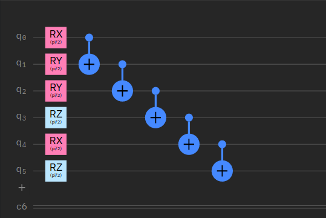

# Layerwise learning for QNNs in Pennylane-Pytorch

This repository is the result of my work as a mentee in the [Quantum Computing Mentorship Program](https://qosf.org/qc_mentorship/) of the _Quantum Open Source Foundation_.

Here, we provide a _proof-of-concept_ for the implementation of a technique for better training Quantum Neural Networks in Pennylane's Pytorch [interface](https://pennylane.readthedocs.io/en/stable/introduction/interfaces/torch.html) known as [layerwise learning](https://arxiv.org/abs/2006.14904).

The task selected for this _PoC_ is the same used in the original paper for the binary classification between the handwritten digits _3_ and _6_ in the MNIST dataset.

## About us :flushed:

### Mentee
__For LinkedIn:__ My name is [Felipe Oyarce](https://www.linkedin.com/in/fioyarce/). Master in Quantum Optics. Machine Learning Developer at [NotCo's](https://notco.com/us/) AI Team and Quantum Computing Enthusiast. Inspired in technological solutions to real-world problems. 

__Official description:__ I'm a Broccoli, excellent for health but I don't attract people's attention. Sometimes I cry a little.

### Mentor
[Theodor Isacsson](https://github.com/thisac) is a Quantum Software Developer at [Xanadu](https://www.xanadu.ai/), enthusiastic about pushing the limits of quantum computing software and expanding its usability and usefulness in the field. Outside of work he’s an avid traveller, enjoying adventurous trips, hiking and exploring the world.

## Overview of Layerwise learning :nerd_face:

There is a very well known problem when trying to train effectively a Quantum Neural Network (or Parametrized Quantum Circuit) called [Barren Plateaus](https://pennylane.ai/qml/demos/tutorial_barren_plateaus.html), described as the phenomenon in which the gradients of a quantum circuit vanish exponentially when the size of the circuit to train increases, this means more qubits and layers. This is a huge limitation because it requires to know very well the problem to solve in order to select properly the circuit architecture. If you want to start by random architectures you're going to face Barren Plateaus :sweat:.

You can visualize Barren Plateaus like a very flat surface of the loss landscape, so its almost impossible to roll down (minimize the function) over this surface.

### Yes, but

Different strategies have been proposed for avoiding Barren Plateaus for example by using [local cost function](https://pennylane.ai/qml/demos/tutorial_local_cost_functions.html).

In __layerwise learning__ the strategy is to gradually increase the number of parameters by adding a few layers and training them while freezing the parameters of previous layers already trained. Once you've reached the complete size of the circuit then you define a partition of the weights to train first on that subset of the weights and then on the remaining weights. Our implemention here is very simple, first we train over the first half of the circuit while freezing the other half and then we swap to train the other part.

An easy way for understanding this technique is to think that we're dividing the problem into smaller circuits to successfully avoid to fall into Barren Plateaus :muscle:

### Training the circuit little by little :walking:

#### Layer structure
A layer in this approach is composed by a set of single qubit gates randomly chosen between RZ, RY and RZ rotations in each qubit and a set of CZ two qubits gates in a ladder structure. Forget about the parameters in the example image, those are the trainable parameters of each layer.

#### Phase I: Increasing the circuit depth

As we mentioned earlier, here the idea is to define a number of layers to add in each step of Phase I, e.g two layers per step, and optimize the circuit just considering the new parameters as trainable parameters while freezing the previous layers.

#### Phase II: Split the circuit into pieces

Then, the circuit is splitted into larger partitions with the parameters from Phase I, so we consider these parameters as the initial weights in the optimization. In each sweep you train a partition of the weights while freezing the other partitions. Remember that here we train the circuit in halves.

#### Main ingredients :bread:

- Choose a way for encoding the data into the circuit. Here we use an [Angle Encoding](https://pennylane.readthedocs.io/en/stable/code/api/pennylane.templates.embeddings.AngleEmbedding.html).
- Implement the layer structure. 
- In Phase I, initialize all the weights as zero.
- Think a way of training the circuit just on subsets of the total number of parameters for Phase II.

## Our implementation :smile:

In our implementation we transform the quantum circuit into a [TorchLayer](https://pennylane.readthedocs.io/en/stable/code/api/pennylane.qnn.TorchLayer.html) to be used within a [Sequential](https://pytorch.org/docs/stable/generated/torch.nn.Sequential.html) model in Pytorch.

## References
[[1]](https://arxiv.org/abs/1803.11173) McClean et al., 2018. Barren plateaus in quantum neural network training landscapes.

[[2]](https://arxiv.org/abs/2006.14904) Skolik et al., 2020. 
Layerwise learning for quantum neural networks.

[[3]](https://blog.tensorflow.org/2020/08/layerwise-learning-for-quantum-neural-networks.html) Tensorflow quantum Blog post about layerwise learning.

[[4]](https://www.youtube.com/watch?v=lz8BOz5KPZg) Tensorflow quantum YouTube's video about layerwise learning.

